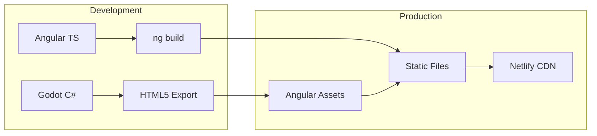
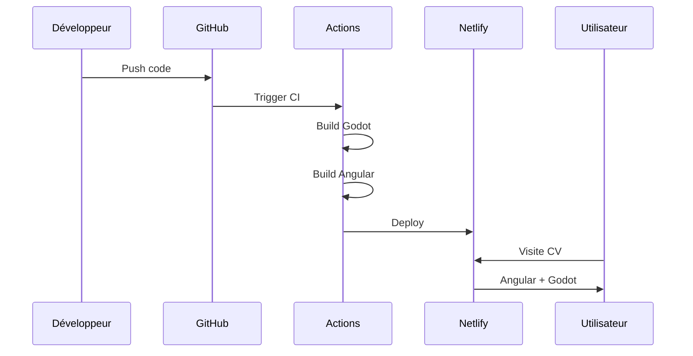

# CV  Godot + Angular

> 
## 🎯 Démo

🔗 **[Voir le CV en ligne](https://myownworld.netlify.app/)**

## ⚡ Technologies

- **Frontend:** Angular 21 + Tailwind CSS
- **Jeu:** Godot 3.6.2 + C#/.NET
- **Déploiement:** Netlify
- **CI/CD:** GitHub Actions

## 🏗️ Architecture

[Diagramme C4 à venir]

## 🚀 Installation locale

### Prérequis
- Node.js 22+
- .NET 8.0+
- Godot 3.6.2 avec support Mono

### Steps
```bash
# 1. Cloner le projet
git clone https://github.com/VOTRE-USERNAME/votre-repo.git

# 2. Angular
cd angular
npm install
ng serve

# 3. Godot (développement)
# Ouvrir godot/ dans Godot Editor
```

### 📁 Structure du projet

```Text
├── .github/workflows/     # Pipeline CI/CD
├── godot/                 # Projet Godot C#
├── angular/               # Application Angular
└── docs/                  # Documentation
```

### 🔄 Workflow de développement
1. Développement Godot → Export local
2. Copy vers Angular → Test local
3. Push → Pipeline automatique
4. Deploy → Netlify

#### Architectures 


